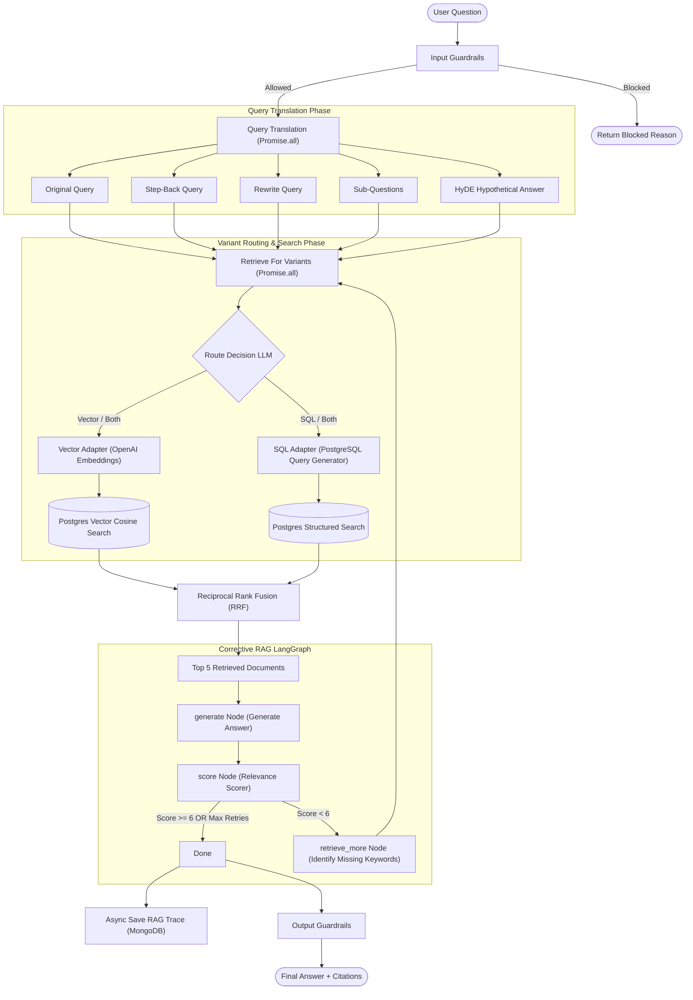

# Advanced RAG Course Subtitle Assistant

Full-stack Next.js app for asking questions against Udemy course subtitle files and returning answer citations with lesson names and timestamps.

## Setup

1. Install dependencies with `npm install`.
2. Copy `.env.example` to `.env.local` and fill `OPENAI_API_KEY`, `DATABASE_URL`, and optionally `MONGODB_URI`.
3. Put subtitles at `class-subtitle/`, or set `SUBTITLE_ROOT` to the folder that contains the module folders.
4. Ingest subtitles:

```bash
npm run ingest -- --reset
```

Use `npm run ingest -- --dry-run` to validate parsing and chunking without database or OpenAI calls.

5. Start the app:

```bash
npm run dev
```

## Pipeline



- Phase 1: `scripts/ingest.ts`, `lib/subtitles.ts`, `lib/db.ts`
- Phase 2: `lib/pipeline.ts`, `lib/generation.ts`, `app/api/ask/route.ts`, `app/page.tsx`
- Phase 3: `lib/guardrails.ts`, `lib/query-translation.ts`
- Phase 4: `lib/retrieval.ts`
- Phase 5: `lib/corrective-rag.ts`
- Phase 6: `lib/guardrails.ts`
